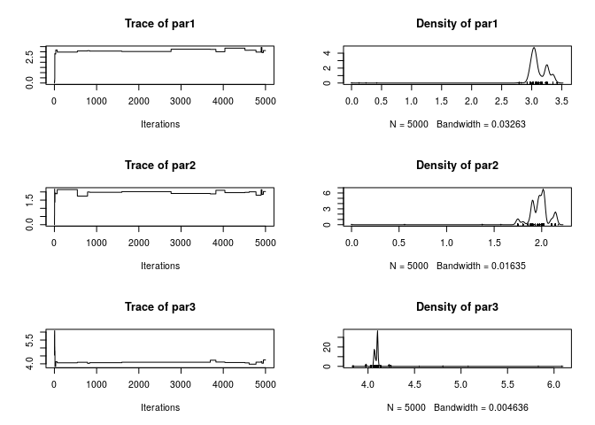
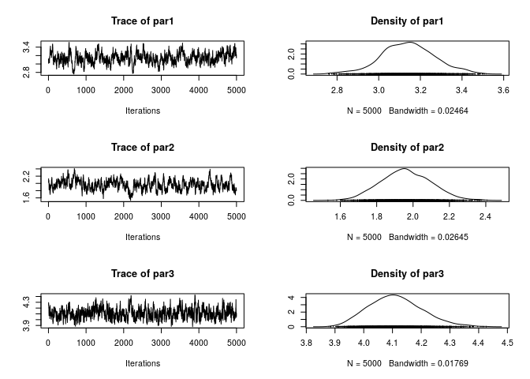
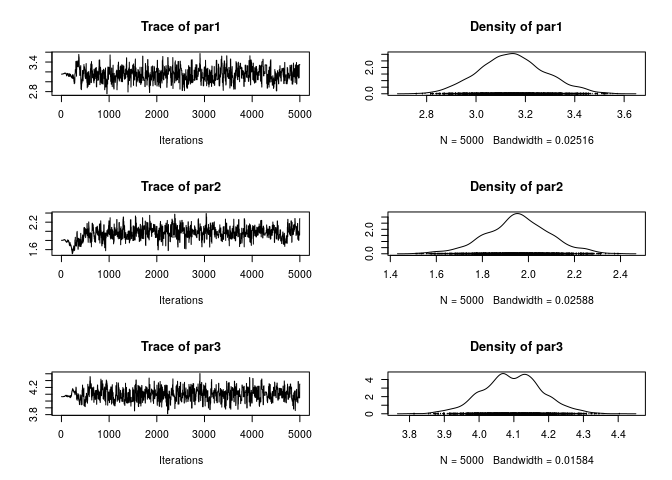
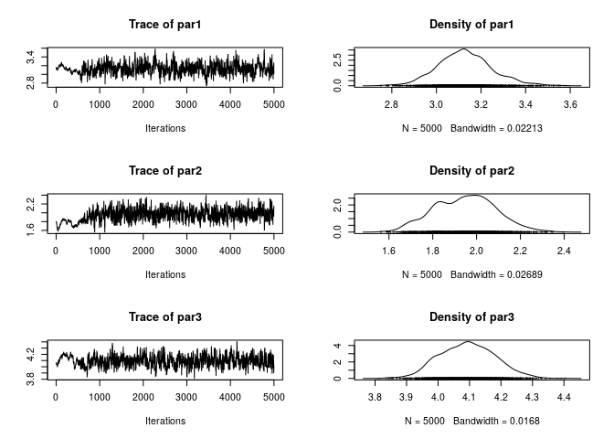

# fmcmc: A friendly MCMC framework 

[](https://doi.org/10.21105/joss.01427)
[](https://travis-ci.org/USCbiostats/fmcmc)
[](https://ci.appveyor.com/project/gvegayon/fmcmc)
[](https://ci.appveyor.com/project/gvegayon/fmcmc)
[](https://codecov.io/github/USCbiostats/fmcmc?branch=master)
[](https://www.tidyverse.org/lifecycle/#stable)
[](https://cran.r-project.org/package=fmcmc)
[](https://cran.r-project.org/package=fmcmc)

## What

The `fmcmc` R package provides a lightweight general framework for
implementing Markov Chain Monte Carlo methods based on the
Metropolis-Hastings algorithm. This implementation’s main purpose lies
in the fact that the user can incorporate the following in a flexible
way:

1.  **Automatic convergence checker**: The algorithm splits the MCMC
    runs according to the frequency with which it needs to check
    convergence. Users can use either one of the included functions
    (`convergence_gelman`, `convergence_geweke`, etc.), or provide their
    own.

2.  **Run multiple chains in parallel fashion**: Using either a `PSOCK`
    cluster (default), or providing a personalized cluster object like
    the ones in the `parallel` R package.

3.  **User defined transition kernels**: Besides of canonical Gaussian
    Kernel, users can specify their own or use one of the included in
    the package, for example: `kernel_normal`,
    `kernel_normal_reflective`, `kernel_unif`, or
    `kernel_unif_reflective`.

All the above without requiring compiled code.

## Who is this for?

While a lot of users rely on MCMC tools such as Stan (via the
[rstan](https://cran.r-project.org/package=rstan) package) or WinBUGS
(via [rstan](https://cran.r-project.org/package=R2WinBUGS)), in several
settings either these tools are not enough or provide too much for
things that do not need that much. So, this tool is for you if:

  - You have a simple model to estimate with Metropolis-Hastings.

  - You want to run multiple chains of your model using out-of-the-box
    parallel computing.

  - You don’t want (or cannot) rely on external tools (so you just need
    good-old base R only for your models).

  - You want to implement a model in which your model parameters are
    either bounded (like a standard error, for example), or are not,
    say, continuous (e.g., a size variable in a Binomial distribution),
    so you need your own transition kernel.

In any other case, you may want to take a look at the previously
mentioned R packages, or check out the
[mcmc](https://cran.r-project.org/package=mcmc) R package, which also
implements the Metropolis-Hastings algorithm (although with not all the
features that this R package has), the
[adaptMCMC](https://cran.r-project.org/package=adaptMCMC) R package, or
the [MCMCpack](https://cran.r-project.org/package=MCMCpack) R package.

# Installing

From github:

``` r
devtools::install_github("USCbiostats/fmcmc")
```

# Citation

``` 

To cite fmcmc in publications use:

  Vega Yon et al., (2019). fmcmc: A friendly MCMC framework. Journal of
  Open Source Software, 4(39), 1427,
  https://doi.org/10.21105/joss.01427

A BibTeX entry for LaTeX users is

  @Article{,
    title = {fmcmc: A friendly MCMC framework},
    author = {George {Vega Yon} and Paul Marjoram},
    journal = {The Journal of Open Source Software},
    year = {2019},
    month = {jul},
    volume = {4},
    number = {39},
    doi = {10.21105/joss.01427},
    url = {https://doi.org/10.21105/joss.01427},
  }
```

# Example: Linear regression model

## First run

In the following we show how to use the package for estimating
parameters in a linear regression model. First, let’s simulate some data
to use:

``` r
set.seed(78845)
n <- 1000
X <- rnorm(n)
y <- 3.0 + 2.0*X + rnorm(n, sd = 4)
```

As you can see, in this case we have three parameters to estimate, the
constant (2.0), the \(\beta\) coefficient (2.0), and the standard
deviation parameter of the error (1.5).

To estimate this model, we can either maximize the log-likelihood
function–which is what is usually done–or we could do it using MCMC. In
either case, we need to specify the log(unnormalized some
times)-likelihood function:

``` r
ll <- function(p, X., y.) {
  
  joint_ll <- dnorm(y. - (p[1] + X.*p[2]), sd = p[3], log = TRUE)
  joint_ll <- sum(joint_ll)
  
  # If is undefined, then we explicitly return infinte (instead of NaN, for
  # example)
  if (!is.finite(joint_ll))
    return(-Inf)
  
  joint_ll
}
```

Notice that the function has more than 1 argument, in this case, `p`,
which is the vector of parameters, `X.` and `y.`, which hold the data of
our model.

Let’s do a first run of the MCMC algorithm using the function of the
same name (first, load the package, of course):

``` r
library(fmcmc)

# Running the MCMC (we set the seed first)
set.seed(1215)
ans <- MCMC(
  ll,
  initial = c(0, 0, sd(y)),
  nsteps  = 5000,
  X.      = X,
  y.      = y
  )
```

As the output object is an object of class `mcmc` from the `coda` R
package, we can use all the functions from it on our output:

``` r
library(coda)
plot(ans)
```

<!-- -->

``` r
summary(ans)
```

    ## 
    ## Iterations = 1:5000
    ## Thinning interval = 1 
    ## Number of chains = 1 
    ## Sample size per chain = 5000 
    ## 
    ## 1. Empirical mean and standard deviation for each variable,
    ##    plus standard error of the mean:
    ## 
    ##       Mean     SD Naive SE Time-series SE
    ## par1 3.126 0.1893 0.002677        0.03128
    ## par2 1.943 0.1234 0.001746        0.04176
    ## par3 4.093 0.0930 0.001315        0.01168
    ## 
    ## 2. Quantiles for each variable:
    ## 
    ##       2.5%   25%   50%   75% 97.5%
    ## par1 2.951 3.013 3.112 3.172 3.511
    ## par2 1.763 1.892 1.956 2.026 2.171
    ## par3 3.979 4.064 4.106 4.134 4.186

While the summary statistics look very good (we got very close to the
original parameters), the trace of the parameters looks vary bad (poor
mixing). We can re-run the algorithm changing the scale parameter in the
`kernel_normal` function. In order to do so, we can simply pass `ans` as
the `initial` argument so that the function starts from the last point
of that chain:

``` r
ans <- MCMC(
  ll,
  initial = ans,
  nsteps  = 5000,
  X.      = X,
  y.      = y,
  kernel  = kernel_normal(scale = .05) # We can set the scale parameter like this
  )
plot(ans)
```

<!-- -->

Much better\! Now, what if we use Vihola (2012) Robust Adaptive
Metropolis (which is also implemented in the R package
[adaptMCMC](https://cran.r-project.org/package=adaptMCMC))

``` r
ans_RAM <- MCMC(
  ll,
  initial = ans,
  nsteps  = 5000,
  X.      = X,
  y.      = y,
  kernel  = kernel_ram() 
  )
plot(ans_RAM)
```

<!-- -->

``` r
1 - rejectionRate(ans_RAM)
```

    ##      par1      par2      par3 
    ## 0.3510702 0.3510702 0.3510702

We can also try using Haario et al (2001) Adaptive Metropolis

``` r
ans_AM <- MCMC(
  ll,
  initial = ans,
  nsteps  = 5000,
  X.      = X,
  y.      = y,
  kernel  = kernel_adapt() 
  )
plot(ans_AM)
```

<!-- -->

``` r
1 - rejectionRate(ans_AM)
```

    ##      par1      par2      par3 
    ## 0.3832767 0.3832767 0.3832767

## Automatic stop

Now, suppose that the algorithm actually takes a lot of time to actually
reach stationary state, then it would be nice to actually sample from
the posterior distribution once convergence has been reached. In the
following example we use multiple chains and the Gelman diagnostic to
check for convergence of the chain:

``` r
set.seed(1215) # Same seed as before
ans <- MCMC(
  ll,
  initial = c(0, 0, sd(y)),
  nsteps  = 5000,
  X.      = X,
  y.      = y,
  kernel  = kernel_normal(scale = .05),
  nchains = 2,                           # Multiple chains
  conv_checker = convergence_gelman(50) # Checking for conv. every 200 steps
  )
```

    ## Convergence has been reached with 1000 steps (1000 final count of samples).

As a difference from the previous case, now we didn’t had to wait until
the 5,000 steps were done, but the algorithm stopped for us, allowing us
to start generating the desired sample much quicker.

## Kernels: Making sure that we get positive values

For this final example, we will use the `kernel` argument and provide
what corresponds to a transition kernel which makes proposals within
certain boundaries, in particular, we want the algorithm to propose only
positive values for the `sd` parameter, which we now must be positive.

More over, since we now from a fact that we will only get positive
values, we can go further and modify `ll` skipping the check for finite
values:

``` r
ll <- function(p, X., y.) {
  
  sum(dnorm(y. - (p[1] + X.*p[2]), sd = p[3], log = TRUE))

}
```

Much simpler function\! Let’s do the call of the MCMC function
specifying the right transition kernel to increase the acceptance rate.
In this example, we will set the max of all parameters to be 5.0, and
the min to be -5.0 for the constant and 0 for the beta coefficient and
the variance parameter, all this using the `kernel_normal_reflective`
(which implements a normal kernel with boundaries) function:

``` r
set.seed(1215) # Same seed as before
ans <- MCMC(
  ll,
  initial = c(0, 0, sd(y)),
  nsteps  = 5000,
  X.      = X,
  y.      = y,
  kernel  = kernel_normal_reflective(
    ub    = 5.0,               # All parameters have the same upper bound
    lb    = c(-5.0, 0.0, 0.0), # But lower bound is specified per parameter
    scale = 0.05               # This is the same scale as before
    ),
  nchains = 2,                           
  conv_checker = convergence_gelman(50)
  )
```

    ## Convergence has been reached with 550 steps (550 final count of samples).

Again, as the proposal kernel has lower and upper bounds, then we are
guaranteed that all proposed states are within the support of the
parameter space.

# Other tools

  - <https://cran.r-project.org/web/packages/mcmc/mcmc.pdf>

  - <https://cran.r-project.org/web/packages/HybridMC/HybridMC.pdf>

  - <https://cran.r-project.org/web/packages/adaptMCMC/adaptMCMC.pdf>

  - <https://cran.r-project.org/web/packages/elhmc/elhmc.pdf>

# Contributing to `fmcmc`

We welcome contributions to `fmcmc`. Whether it is reporting a bug,
starting a discussion by asking a question, or proposing/requesting a
new feature, please go by creating a new issue
[here](https://github.com/USCbiostats/fmcmc/issues) so that we can talk
about it.

Please note that the ‘fmcmc’ project is released with a [Contributor
Code of Conduct](CODE_OF_CONDUCT.md). By contributing to this project,
you agree to abide by its terms.

# Funding

Supported by National Cancer Institute Grant \#1P01CA196596.
